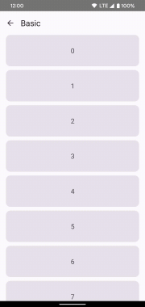
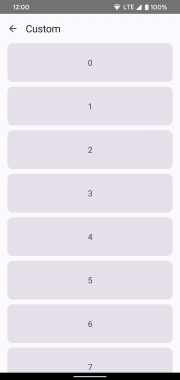

# Pull To Refresh for Jetpack Compose

A library which provides a layout which provides the pull-to-refresh UX pattern.



This project is inspired by Google's [SwipeRefresh].

# Customization

You can also provide your own custom indicator. Here is an example:



See the [source code][sample] for more information.

# Download

```groovy
repositories {
    mavenCentral()
}

dependencies {
    implementation "com.github.fengdai.compose:pulltorefresh:<version>"
}
```

# License

    Copyright 2022 Feng Dai

    Licensed under the Apache License, Version 2.0 (the "License");
    you may not use this file except in compliance with the License.
    You may obtain a copy of the License at

       http://www.apache.org/licenses/LICENSE-2.0

    Unless required by applicable law or agreed to in writing, software
    distributed under the License is distributed on an "AS IS" BASIS,
    WITHOUT WARRANTIES OR CONDITIONS OF ANY KIND, either express or implied.
    See the License for the specific language governing permissions and
    limitations under the License.

[SwipeRefresh]: https://github.com/google/accompanist/blob/main/swiperefresh/README.md

[sample]: sample/src/main/java/com/github/fengdai/compose/pulltorefresh/sample/Custom.kt
